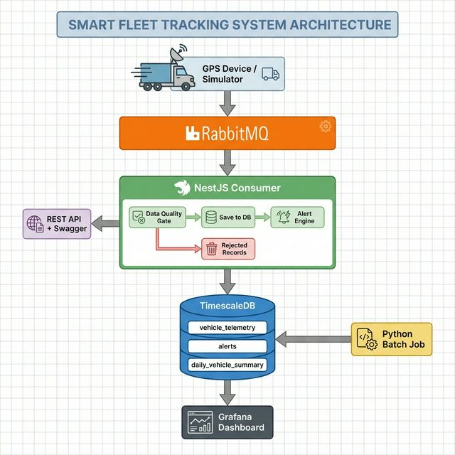

# Smart Fleet Tracking & Alerting System

Hệ thống theo dõi và cảnh báo phương tiện vận tải theo thời gian thực, xây dựng trên kiến trúc event-driven microservice. Hệ thống thu thập dữ liệu GPS từ thiết bị giám sát, xử lý qua message queue, lưu trữ trong time-series database, và hiển thị trên dashboard trực quan.

Dự án mô phỏng bài toán thực tế của các công ty vận tải tại Việt Nam — nơi việc giám sát tốc độ và hành trình xe là yêu cầu bắt buộc theo quy định pháp luật (Nghị định 10/2020/NĐ-CP).

## Tech Stack

| Layer | Technology | Vai trò |
|-------|-----------|---------|
| Backend | NestJS (TypeScript) | REST API + RabbitMQ Consumer |
| Message Queue | RabbitMQ | Async ingestion pipeline |
| Database | PostgreSQL 16 + TimescaleDB | Time-series storage |
| Dashboard | Grafana | Monitoring & visualization |
| Container | Docker Compose | Orchestration |
| CI | GitHub Actions | Lint + Unit tests |

## Key Features

### Real-time Telemetry Ingestion
- Thu nhận dữ liệu GPS (tọa độ, tốc độ, hướng, trạng thái engine) qua RabbitMQ message queue
- Data Quality validation tại consumer layer — loại bỏ GPS drift, tọa độ ngoài lãnh thổ VN, tốc độ bất thường
- Bản ghi bị reject được lưu vào bảng audit trail (JSONB) để debug nguồn dữ liệu xấu

### Alerting Engine
- Đánh giá vi phạm real-time trên từng data point (latency < 2 giây)
- Phân loại mức độ nghiêm trọng: CRITICAL (> 120 km/h), HIGH (> 80 km/h), MEDIUM (engine off khi xe di chuyển)
- Idempotent alert creation — mỗi loại vi phạm chỉ tồn tại 1 active alert per vehicle, tránh spam

### Time-series Analytics
- TimescaleDB `time_bucket()` aggregate dữ liệu theo interval tùy ý (1 phút → 1 giờ)
- Continuous aggregate tự động pre-compute thống kê theo giờ, giảm query time 10-100x
- `DISTINCT ON` + composite index cho fleet overview — lấy vị trí mới nhất tất cả xe trong 1 query

### Daily Batch Aggregation
- Python batch job tính toán chỉ số vận hành hàng ngày: quãng đường (Haversine), tốc độ trung bình, số lần vi phạm
- Idempotent upsert (`ON CONFLICT DO UPDATE`) — chạy lại không tạo duplicate

### Grafana Dashboard
- Fleet overview: vị trí, tốc độ, trạng thái engine của tất cả xe
- Alert timeline và severity breakdown
- Daily summary table và Data Quality metrics

## Architecture

### Data Flow



### Project Structure

```
smart-fleet-tracking/
├── src/
│   ├── main.ts                     # Hybrid app: HTTP + RabbitMQ Microservice
│   ├── app.module.ts               # Root module — DI container
│   ├── config/
│   │   ├── database.config.ts      # TypeORM + TimescaleDB connection
│   │   └── rabbitmq.config.ts      # Queue config — durable, persistent
│   ├── telemetry/
│   │   ├── telemetry.consumer.ts   # RabbitMQ event handler + DQ gate
│   │   ├── telemetry.service.ts    # CRUD + time_bucket analytics
│   │   ├── telemetry.controller.ts # REST API endpoints
│   │   └── entities/
│   │       └── vehicle-telemetry.entity.ts
│   ├── alert/
│   │   ├── alert.service.ts        # Real-time evaluation + idempotent creation
│   │   ├── alert.controller.ts     # Alert CRUD + resolve workflow
│   │   └── entities/
│   │       └── alert.entity.ts
│   ├── vehicle/
│   │   ├── vehicle.service.ts      # CRUD + soft delete
│   │   └── vehicle.controller.ts
│   ├── health/
│   │   └── health.controller.ts    # Liveness probe
│   └── common/
│       └── constants.ts            # Speed thresholds — NĐ 100/2019
├── scripts/
│   ├── gps-simulator.ts            # GPS data simulator (5 xe TP.HCM)
│   └── daily_aggregation.py        # Batch job — Python + psycopg2
├── init-scripts/
│   └── init.sql                    # Schema + hypertable + compression policy
├── grafana/
│   ├── dashboards/
│   │   └── fleet-overview.json     # Pre-configured dashboard
│   └── provisioning/               # Auto-provision datasource
├── test/
│   └── unit/                       # Jest unit tests
├── .github/
│   └── workflows/
│       └── ci.yml                  # Lint + test pipeline
├── docker-compose.yml              # 4 services orchestration
├── Dockerfile                      # Node 20 Alpine
└── .env.example                    # Environment variables template
```

## Technical Highlights

### NestJS — Framework Backend

NestJS được chọn vì kiến trúc modular + dependency injection phù hợp với hệ thống nhiều domain (vehicle, telemetry, alert). Cụ thể:

- **Hybrid Application**: chạy đồng thời HTTP server (REST API cho Swagger) và RabbitMQ Microservice consumer trong cùng 1 process — giảm operational complexity so với việc deploy 2 service riêng
- **Decorator-based routing**: `@EventPattern('telemetry.gps')` khai báo rõ ràng message pattern, dễ trace luồng xử lý
- **Built-in validation**: `class-validator` + `ValidationPipe` whitelist input tại gateway, ngăn bad data trước khi vào business logic

### TimescaleDB — Time-series Database

PostgreSQL + TimescaleDB extension thay vì InfluxDB hay MongoDB vì:

- **Hypertable**: tự động partition bảng `vehicle_telemetry` theo thời gian (chunk 1 ngày). Query theo time range chỉ scan chunk liên quan (chunk exclusion), không full table scan
- **time_bucket()**: aggregate dữ liệu theo interval tùy ý — feature mà `DATE_TRUNC` của PostgreSQL thuần không hỗ trợ
- **Continuous Aggregate**: materialized view tự động refresh, pre-compute thống kê theo giờ. Dashboard đọc từ view này thay vì query raw data
- **Compression Policy**: tự động nén data > 7 ngày, tiết kiệm ~90% disk mà vẫn query được bình thường
- **SQL standard**: sử dụng JOIN, Window Functions, DISTINCT ON — tận dụng ecosystem PostgreSQL mà không cần học query language mới

### RabbitMQ — Message Queue

Chọn RabbitMQ thay vì Kafka vì:

- Fleet scale hiện tại (< 1000 xe) chưa cần throughput hàng triệu msg/s của Kafka
- RabbitMQ cung cấp flexible routing (exchange types) cho tương lai: topic-based routing theo vùng, loại xe
- Durable queue + persistent messages đảm bảo không mất data khi service restart

### Idempotency Design

Hệ thống xử lý idempotency ở nhiều tầng:

| Tầng | Cơ chế | Mục đích |
|------|--------|----------|
| Alert creation | Application-level dedup (query trước khi insert) | Tránh spam cảnh báo |
| Batch aggregation | `ON CONFLICT DO UPDATE` (upsert) | Chạy lại batch job không tạo duplicate |
| Consumer | `noAck: true` + append-only hypertable | GPS data có natural key (vehicle_id, ts) |

## Quick Start

### Yêu cầu

- Docker & Docker Compose
- Node.js 20+ (cho GPS simulator)

### 1. Clone và cấu hình

```bash
git clone https://github.com/<your-username>/smart-fleet-tracking.git
cd smart-fleet-tracking
cp .env.example .env
```

### 2. Khởi chạy toàn bộ hệ thống

```bash
docker-compose up -d
```

Lệnh này khởi tạo 4 services:

| Service | Port | Mô tả |
|---------|------|-------|
| TimescaleDB | 5432 | Database + auto-init schema |
| RabbitMQ | 5672 / 15672 | Message queue + Management UI |
| Backend | 3000 | NestJS API + Consumer |
| Grafana | 3001 | Dashboard |

### 3. Kiểm tra hệ thống

```bash
# Health check
curl http://localhost:3000/health

# Swagger API docs
# Mở trình duyệt: http://localhost:3000/api/docs

# RabbitMQ Management
# Mở trình duyệt: http://localhost:15672 (fleet_user / fleet_pass)

# Grafana Dashboard
# Mở trình duyệt: http://localhost:3001 (admin / admin)
```

### 4. Chạy GPS Simulator

```bash
npm install
npx ts-node scripts/gps-simulator.ts
```

Simulator giả lập 5 xe tại TP.HCM, gửi GPS data mỗi 2 giây vào RabbitMQ. Consumer tự động xử lý và hiển thị trên Grafana.

### 5. Chạy Daily Batch Aggregation

```bash
# Cài Python dependencies
pip install psycopg2-binary

# Chạy aggregation cho ngày hôm qua
python scripts/daily_aggregation.py

# Hoặc chỉ định ngày cụ thể
python scripts/daily_aggregation.py --date 2026-02-18
```

### 6. Chạy Unit Tests

```bash
npm test
```

## API Endpoints

| Method | Endpoint | Mô tả |
|--------|----------|-------|
| GET | `/health` | Health check |
| GET | `/vehicles` | Danh sách phương tiện |
| POST | `/vehicles` | Tạo phương tiện mới |
| GET | `/telemetry/fleet/latest` | Vị trí mới nhất tất cả xe |
| GET | `/telemetry/:vehicleId` | Lịch sử GPS theo xe |
| GET | `/telemetry/:vehicleId/stats` | Thống kê tốc độ (time_bucket) |
| GET | `/telemetry/:vehicleId/hourly` | Thống kê theo giờ (continuous aggregate) |
| GET | `/alerts` | Danh sách cảnh báo |
| GET | `/alerts/vehicle/:vehicleId` | Cảnh báo theo xe |
| PATCH | `/alerts/:id/resolve` | Đánh dấu đã xử lý |

Chi tiết request/response xem tại Swagger: `http://localhost:3000/api/docs`

## License

MIT
